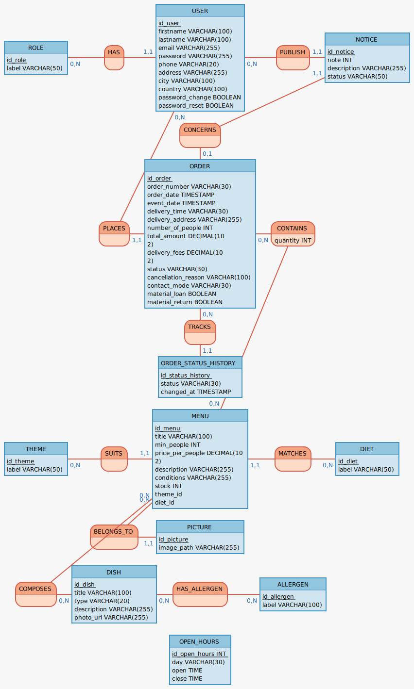
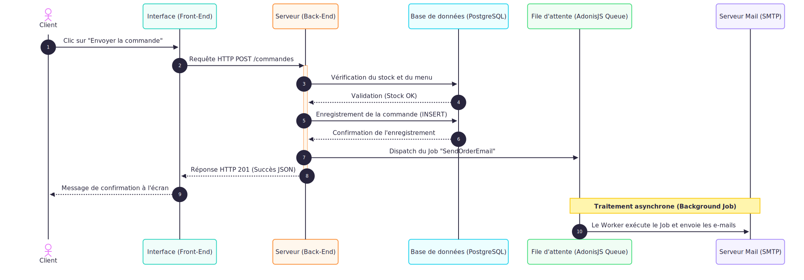

# Vite & Gourmand

Application web pour un traiteur bordelais permettant de consulter les menus et passer des commandes en ligne.

## Stack technique

- **Back-end** : AdonisJS v7
- **Front-end** : Inertia.js + React + Tailwind CSS + shadcn/ui
- **Base de données relationnelle** : PostgreSQL
- **Base de données NoSQL** : MongoDB
- **Envoi de mails** : SMTP (Mailtrap en développement)

## Prérequis

- Node.js >= 24
- pnpm (`npm install -g pnpm`)
- Docker (PostgreSQL + MongoDB inclus via Docker Compose)

## Installation

```bash
# 1. Cloner le dépôt
git clone <https://github.com/brunoverpet/vite-gourmand>
cd vite-gourmand

# 2. Installer les dépendances
pnpm install

# 3. Configurer l'environnement
cp .env.example .env
```

## Configuration de l'environnement

Remplir le fichier `.env` avec les valeurs suivantes :

```env
APP_KEY=              # Générer avec : node ace generate:key

DB_HOST=127.0.0.1
DB_PORT=5432
DB_USER=              # Utilisateur PostgreSQL
DB_PASSWORD=          # Mot de passe PostgreSQL
DB_DATABASE=          # Nom de la base de données

MONGO_URI=            # Ex : mongodb://localhost:27017/vite-gourmand

MAIL_MAILER=smtp
MAIL_FROM_ADDRESS=    # Votre adresse mail
MAIL_FROM_NAME=Vite & Gourmand
SMTP_HOST=sandbox.smtp.mailtrap.io
SMTP_PORT=2525
SMTP_USER=            # Credentials depuis Mailtrap > SMTP Settings
SMTP_PASS=            # Credentials depuis Mailtrap > SMTP Settings
```

> Pour les mails : créer un compte gratuit sur [mailtrap.io](https://mailtrap.io), aller dans **Email Testing → My Inbox → SMTP Settings** et copier les credentials.

## Lancer le projet

```bash
# 1. Démarrer PostgreSQL et MongoDB via Docker
docker compose up -d

# 2. Créer les tables et insérer les données de test
node ace migration:run
node ace db:seed --files="database/seeders/index.ts"

# 3. Démarrer le serveur de développement
pnpm dev
```

> **MongoDB** : inclus dans le Docker Compose, aucune installation séparée nécessaire. Les collections sont créées automatiquement lors du seed.

L'application est accessible sur [http://localhost:3333](http://localhost:3333).

## Comptes de test

| Rôle    | Email                    | Mot de passe |
| ------- | ------------------------ | ------------ |
| Admin   | admin@vite-gourmand.fr   | Admin1234!   |
| Employé | employe@vite-gourmand.fr | Employe1234! |
| Client  | client@vite-gourmand.fr  | Client1234!  |

## Commandes utiles

```bash
node ace migration:run          # Appliquer les migrations
node ace migration:rollback     # Annuler la dernière migration
node ace migration:fresh --seed # Réinitialiser la base + insérer les données
node ace db:seed                # Insérer les données sans réinitialiser
node ace generate:key           # Générer une APP_KEY
pnpm build                      # Builder pour la production
```

## Schéma de base de données

Les fichiers SQL sont disponibles dans `database/schema/` :

- `pg-schema.sql` — création des tables (CREATE TABLE, contraintes, clés étrangères)
- `pg-data.sql` — jeu de données de test (INSERT INTO)

## Déploiement en production

- **Plateforme** : [Render](https://render.com), déploiement via Blueprint (`render.yaml`), build Docker à chaque push sur `main`
- **Base de données relationnelle** : [Neon](https://neon.tech) (PostgreSQL managé, connexion SSL)
- **Base de données NoSQL** : [MongoDB Atlas](https://www.mongodb.com/atlas)
- **Envoi de mails** : SMTP (mêmes variables `SMTP_*` qu'en développement, seuls l'hôte et les identifiants changent — remplace Mailtrap utilisé en développement)
- **Stockage des images** : système de fichiers du conteneur (`DRIVE_DISK=fs`)

### Étapes suivies

1. Création des bases sur Neon (PostgreSQL) et MongoDB Atlas, récupération des URI de connexion
2. Création du service web sur Render à partir du `render.yaml` (build et déploiement Docker automatiques à chaque push sur `main`)
3. Renseignement dans le dashboard Render des variables marquées `sync: false` dans `render.yaml` : `DB_HOST`, `DB_PORT`, `DB_USER`, `DB_PASSWORD`, `DB_DATABASE`, `DB_SSL`, `MONGO_URI`, `APP_URL`, `MAIL_FROM_NAME`, `MAIL_FROM_ADDRESS`, `SMTP_HOST`, `SMTP_PORT`, `SMTP_USER`, `SMTP_PASS`
4. `APP_KEY` généré automatiquement par Render (`generateValue: true`)
5. Migrations et seed exécutés depuis le poste local, en pointant temporairement le `.env` local vers les identifiants de la base Neon :
   ```bash
   node ace migration:run
   node ace db:seed --files="database/seeders/index.ts"
   ```
6. Vérification de l'application sur l'URL fournie par Render (`https://vite-gourmand-rp98.onrender.com`) :
   - chargement de la page d'accueil avec les données réelles (menus, horaires) pour confirmer la connexion à Neon
   - connexion testée avec les 3 comptes de test (admin, employé, client)
   - création d'une commande de test pour vérifier la persistance et l'envoi du mail de confirmation
   - consultation du tableau de bord statistiques pour confirmer la connexion à MongoDB Atlas
   - le plan gratuit Render met le service en veille après inactivité : premier chargement plus lent (10-30s) le temps que le conteneur redémarre

## Documentation

### Choix techniques
[docs/choix-techniques.md](docs/choix-techniques.md)

### Gestion de projet
[docs/gestion-projet.md](docs/gestion-projet.md)

### Modèle Conceptuel de Données


### Diagramme d'utilisation


### Diagramme de séquence

